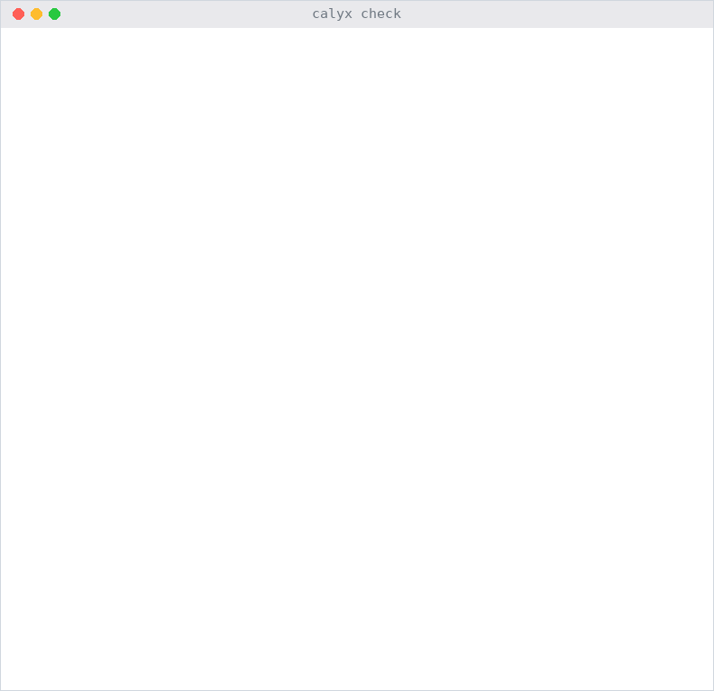

# Calyx

*In English: [README.md](README.md).*

<p align="center"><picture><source media="(prefers-color-scheme: dark)" srcset="media/check_dark.gif"></picture></p>

Agentes de IA já enviam e-mails, movem dinheiro e editam código. Quando uma
dessas chamadas dá timeout, ninguém sabe se ela aconteceu. Repita, e o
cliente recebe o reembolso duas vezes. Não repita, e o reembolso se perde.
Todo framework deixa essa escolha para você, e a maior parte do código nunca
a faz.

A Calyx é uma linguagem para workflows de agentes em que **toda tool declara
seu efeito**, e o compilador **recusa o programa** até ele dizer o que
acontece quando o resultado de uma chamada é incerto. Você escreve os passos;
a Calyx deriva o paralelismo, as novas tentativas e a recuperação depois de
quedas.

Isso é a Calyx: sintaxe parecida com Python, um grafo por baixo, efeitos em
que dá para confiar.

## A Calyx BLOQUEIA efeitos duplicados, antes de rodar

Um reembolso, depois um e-mail. Parece certo:

```python
tool refund(order: Text, amount: Float) -> Unit:
    effect write

tool email(to: Text, body: Text) -> Unit:
    effect write once

graph handle_refund(order: Text, message: Text) -> Text:
    proposal = gemini(decide(order, message))
    paid = refund(order, proposal.amount)
    notice = email("ana@example.com", "refunded {proposal.amount}")
    return "done"
```

O `calyx check` discorda:

```
warning[W0601]: `write` tool without `idempotency_key`
- expected : `idempotency_key param`, so retries and resumed runs cannot apply it twice
- observed : no key: the runtime repeats the call after failures, so the tool itself must be idempotent

error[E0304]: `write once` tool needs a policy for uncertain outcomes
- expected : `on_uncertain verify(...)`, `on_uncertain pause` or `on_uncertain accept_loss`
- observed : no `on_uncertain` property

warning[W0602]: external writes without a defined order
- expected : `notice after paid` (or `paid after notice`), or a value one passes to the other
- observed : `paid` and `notice` both write outside the run and may run at the same time
```

Três linhas corrigem, e elas não são opcionais:

```python
tool refund(request: Text, order: Text, amount: Float) -> Unit:
    effect write
    idempotency_key request               # repetido ou retomado: paga uma vez

tool email(to: Text, body: Text) -> Unit:
    effect write once
    on_uncertain verify(email_sent(to, body))   # deu timeout? confere antes de reenviar

graph handle_refund(request: Text, order: Text, message: Text) -> Text:
    proposal = gemini(decide(order, message))
    paid = refund(request, order, proposal.amount)
    notice = email("ana@example.com", "refunded {proposal.amount}")
    notice after paid
    return "done"
```

Os erros são estruturados (`expected` / `observed` / local), então um agente
de IA consegue lê-los e corrigir o próprio código. Em resumo: o compilador
exige o contrato de efeito que, em Python, só um programador atento lembra de
escrever.

## A Calyx RETOMA sem pagar duas vezes

Toda chamada concluída vai para um diário. Mate o processo em qualquer ponto,
e `calyx resume <id>` continua de onde parou: nenhuma chamada de modelo paga
duas vezes, nenhum reembolso enviado duas vezes. Matamos o workflow de
reembolso (`kill -9`) em 6 pontos:

| Sistema | Certos (de 6) | Reembolsos duplicados | E-mails duplicados |
|---|---|---|---|
| **Calyx** | **6** | **0** | **0** |
| Temporal | 4 | 1 | 1 |
| LangGraph, `durability="sync"` | 4 | 1 | 1 |
| LangGraph, padrão | 3 | 2 | 1 |

Com o cuidado que a documentação deles recomenda (3 linhas a mais em cada),
Temporal e LangGraph também fazem 6 de 6. A diferença é o padrão, não o teto:
na Calyx, essas linhas são obrigatórias. Detalhes em
[`docs/evaluation/comparacao.md`](docs/evaluation/comparacao.md).

## A Calyx é PARALELA

Sem `async`, sem `parallel`, sem threads. Passos que não dependem uns dos
outros rodam ao mesmo tempo, o caminho crítico primeiro:

```python
graph research(topic: Text) -> Text:
    effect read                         # este grafo nunca escreve no mundo
    limits threads 8, budget 2 USD

    plan = gemini(split_topic(topic))
    answers = for each q in plan.questions:     # sem `parallel`, sem `async`
        gemini(summarize(q, web_search(q)))
    return gemini(write_report(topic, answers))
```

Com um modelo real (Gemini), mediana de 3 execuções:

| Perguntas | Calyx | asyncio, à mão | LangGraph | Python, sequencial |
|---|---|---|---|---|
| 5 | **5,1 s** | 5,2 s | 7,3 s | 10,6 s |
| 10 | **6,1 s** | 6,4 s | 8,1 s | 17,3 s |

A Calyx empata com o asyncio escrito à mão. O ganho é não escrever o
paralelismo.

## A Calyx verifica RÁPIDO

**Meta:** verificar qualquer programa em menos de 1 segundo, para que um
agente possa verificar a cada mudança. **Situação:** o exemplo de atendimento
ao cliente, de 155 linhas ([`atendimento.clyx`](examples/atendimento.clyx)),
é verificado em **0,5 ms**. O verificador e o runtime compilam para código
nativo; o `calyx` é um binário só, de ~3 MB.

## A Calyx é PROVADA, dentro de limites

As regras de efeito vêm com três teoremas: uma chamada `write once` acontece
**no máximo uma vez**; terminada por `verify` ou por uma pessoa, **exatamente
uma vez**; e **nada feito é refeito** ao retomar. Para uma chamada, eles são
provados em Lean ([`formal/Effects.lean`](formal/Effects.lean), conferido na
CI). Para programas inteiros, um verificador de modelos limitado tenta toda
combinação de até 2 falhas e 2 quedas, e acha um contraexemplo para cada
hipótese retirada. Formalizar achou dois bugs no runtime, ambos corrigidos.

No [LIMBO](https://github.com/jaxblack/limbo-bench), um benchmark externo de
efeitos duplicados (205 episódios com falha), programas Calyx chegam a
**76%** de sucesso com efeito único com as tools como são (modelos de
fronteira: 74–79%), e a **100%, zero duplicatas** quando toda escrita aceita
chave.

# Como começar

### 1. Instale:

```bash
curl -fsSL https://raw.githubusercontent.com/daltonfontes/calyx/main/install.sh | sh
```

Um binário só, sem dependências. Linux e macOS (x86_64 e ARM); no Windows,
use o WSL.

### 2. Diga ao seu agente para usar a Calyx:

Acrescente ao seu `AGENTS.md`:

```
Ao escrever workflows de agentes:
- escreva em Calyx (.clyx); a especificação é docs/spec/calyx.md
- declare o efeito de toda tool: `read`, `write` com `idempotency_key`,
  ou `write once` com `on_uncertain`
- rode `calyx check <arquivo>` depois de cada mudança, e corrija todo erro
- teste com `calyx run <arquivo> --fake-models` antes de usar modelos reais
```

### 3. Rode (de um clone deste repositório, para os exemplos):

```bash
calyx run examples/refund.clyx --fake-models --request R1 --order A100 --message "chegou quebrado"
export GEMINI_API_KEY=...           # ou qualquer provedor compatível com a OpenAI
calyx run examples/research.clyx --topic "energia solar no Brasil"
calyx runs                          # lista as execuções; `calyx resume <id>` continua uma
calyx build examples/research.clyx  # um executável autocontido, nada a instalar
```

As tools são servidores [MCP](https://modelcontextprotocol.io), escritos em
qualquer linguagem e declarados no `calyx.toml`. `calyx check --tools`
compara cada declaração com o que o servidor diz de si mesmo.

# Exemplos

### Sintaxe == Python, passos == um grafo

Cada `nome = ...` é um passo. Valores não mudam, e a ordem vem dos dados, não
das linhas. Veja o `research` acima.

### Esperar uma pessoa == `receive`

A execução para, grava seu estado no disco e sai; nenhum servidor. Dias
depois, `calyx deliver <id> Approval Approved` e `calyx resume <id>` a
continuam.

```python
message Approval = Approved | Denied(reason: Text)

graph approve(request: Text) -> Text:
    proposal = gemini(propose(request))
    approval = receive Approval about proposal, timeout 3 days:
        on timeout: Denied(reason="nobody answered in 3 days")
    return match approval:
        case Approved: "approved: {proposal}"
        case Denied(reason): "denied ({reason}): {proposal}"
```

### Agentes == laços limitados

Um agente é um passo como outro qualquer, e todo laço tem um limite que o
compilador confere.

```python
graph ask(question: Text) -> Text:
    draft = agent gemini:                       # o ciclo ReAct, limitado
        tools [web_search]
        max_turns 6
        task investigate(question)
        on turn_limit: final_answer
        on stuck: final_answer

    return loop answer = draft, max 2:          # todo laço tem limite
        match gemini(review(question, answer)):
            case Approved:
                done answer
            case Rejected(feedback):
                next gemini(improve(answer, feedback))
        on limit: last
```

Os programas completos por trás desses trechos estão em
[`examples/readme/`](examples/readme), conferidos na CI. Há mais, de sandboxes
para agentes de código a memória por usuário, debates e roteadores de
modelos, em [`examples/`](examples).

# Referências

- Paper: [Calyx: um compilador que exige o contrato de efeito em workflows de agentes](paper/Calyx-pt.pdf) (em inglês: [Calyx.pdf](paper/Calyx.pdf)).
- Formalização: [Effects.lean](formal/Effects.lean), as regras de efeito e suas provas, em Lean; [formal.md](docs/paper/formal.md) e o verificador limitado [model.py](bench/formal/model.py).
- Especificação: [calyx.md](docs/spec/calyx.md), a linguagem, toda verificação e todo código de erro.
- Avaliação: [docs/evaluation/](docs/evaluation), contra Python, LangGraph e Temporal, bugs reais e o LIMBO.
- Benchmarks: [bench/](bench), todo script por trás dos números acima, com os dados em `bench/results/`.
- Visão geral: [visao-geral.md](docs/visao-geral.md), o estado de cada marco, como compilar e rodar, a pasta de cada parte.
- Proposta ao MCP: [idempotency-key-hint.md](docs/mcp/idempotency-key-hint.md) (em inglês), chaves de idempotência no `tools/call`, declaradas por tool, com protótipo e medida.
- Design: [docs/discovery/](docs/discovery), as 35 decisões de design e a pesquisa por trás delas.
- Demonstração: [make_check_gif.py](media/make_check_gif.py) grava o GIF acima a partir da saída real do `calyx check`.

# Limitações

```
- A Calyx é nova (v0.3). Espere bugs e mudanças incompatíveis.
- As mensagens do compilador e os nomes da linguagem são em inglês.
- As garantias dependem de hipóteses declaradas: o serviço respeita a chave
  de idempotência, e o `verify` lê o estado atual. A Calyx não tem como
  conferir um serviço que ignora chaves; `calyx check --tools` pega efeitos
  errados, e chaves ignoradas só de servidores que mandam
  `idempotencyKeyHint`, uma anotação que propomos ao MCP
  (docs/mcp/idempotency-key-hint.md).
- `on_uncertain accept_loss` pode perder o efeito. É isso que ele significa.
- As provas em Lean cobrem uma chamada; programas inteiros têm uma
  verificação limitada. Os dois modelos são escritos à mão, não extraídos
  do runtime em C.
- Agentes não podem chamar tools `write once`.
- Uma máquina só: o diário são arquivos locais. Ainda sem execução distribuída.
- Tools só como servidores MCP via stdio; modelos só por APIs compatíveis com
  a da OpenAI.
- A camada pura não tem recursão, de propósito (todo programa termina).
- Sem language server, depurador ou REPL.
- A maioria dos experimentos usa modelos falsos; os de paralelismo e
  recuperação foram repetidos com o Gemini. Os baselines e o corpus de bugs
  foram escritos pelo autor da Calyx; as tarefas e o avaliador do LIMBO não.
- Sem Windows (o WSL funciona).
```

**A CALYX É JOVEM. ESPERE BUGS E [RELATE-OS](https://github.com/daltonfontes/calyx/issues).**

# Créditos

A Calyx foi criada por [Dalton Fontes](https://github.com/daltonfontes), que
a concebeu e dirigiu, leu os trabalhos relacionados e revisou cada mudança. O
código, os experimentos e o paper foram escritos com o Claude (Anthropic)
como assistente de programação.

# Licença

[MIT](LICENSE).
